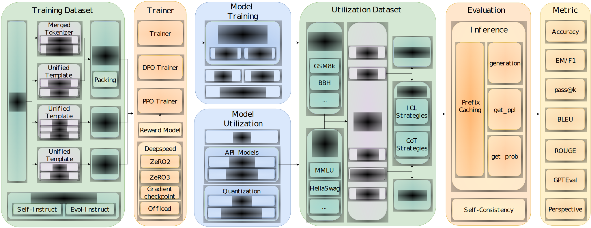

# LLMBox

LLMBox is a comprehensive library for implementing LLMs, including **a unified training pipeline** and **comprehensive model evaluation**.




## Key Features

Training

- **Diverse training strategies:** We support multiple training strategies, including Supervised Fine-tuning(SFT), Pre-training(PT), PPO and DPO.

- **Comprehensive supervised fine-tuning datasets:** We support 9 SFT datasets as the inputs for training.

- **Tokenizer merging:** We support the tokenizer merging function to expand the vocabulary.

- **Dataset merging and Data construction strategies:** We currently support merging multiple datasets for training. `Self-Instruct` and `Evol-Instruct` are also available to process the dataset.

- **Parameter efficient fine-tuning:** `LoRA` and `QLoRA` are supported in SFT or PT.

- **High efficiency in the training of Large Language Models:** We support `FlashAttention` and `Deepspeed` for efficient training.

- **Quantization:** BitsAndBytes and GPTQ quantization are supported.

Utilization

- **Comprehensive Evaluation**:
- **In-Context Learning**: We support various ICL strategies, including `KATE`, `GlobalE`, and `APE`.
- **Chain-of-Thought**: For some datasets, we support three types of CoT evaluation: `base`, `least-to-most`, and `pal`.
- **Ranking Types**: We currently support three ranking types for MultipleChoiceDataset.
- **Prefix Caching**: By caching the `past_key_value` of prefix, we can speed up local inference by up to 6x.
- **vLLM and Flash Attention Support**: We also support [`vLLM`](https://github.com/vllm-project/vllm) and [`Flash Attention`](https://github.com/Dao-AILab/flash-attention) for efficient inference.
- **Quantization**: BitsAndBytes and GPTQ quantization are supported.


## Quick Start

### Install

```python
git clone https://github.com/RUCAIBox/LLMBox.git && cd LLMBox
pip install -r requirements.txt
```

### Quick Start with Training

To pre-train a LLaMA-2 7B model with default settings, you can run the following command:

```bash
cd training
bash bash/run_7b_pt.sh
```

For further supervised fine-tuning, you can run the following command to fine-tune with deepspeed3:

```bash
bash bash/run_7b_ds3.sh
```


### Quick Start with Utilization

To utilize your model or compare with other models, you can run the following command. This is default to run the OpenAI GPT 3.5 turbo model on the CoPA dataset in a zero-shot manner.

```python
python inference.py -m gpt-3.5-turbo -d copa  # --num_shot 0 --model_type instruction
```


## Training

LLMBox Training supports various training strategies and dataset construction strategies, along with some efficiency-improving modules. With the source code, you can use multiple functions with the following guidelines.

- **Merging Tokenizer**:
If you want to pre-train your models on corpora with languages or tokens not well-supported in original language mdoels(e.g., LLaMA), we provide the tokenizer merging function to expand the vocabulary based on the corpora by using [sentencepiece](https://github.com/google/sentencepiece). You can check [merge_tokenizer.py](training/merge_tokenizer.py) for detailed information. Please follow the guide in [Pre-train](training/README.md##2-continual-pre-training-with-your-own-corpora).

- **Merging Datasets**:
If you want to train your models with a mix of multiple datasets, you can pass a list of dataset files or names to LLMBox. LLMBox will transfer each file or name into a PTDataset or SFTDataset, and merge them together to construct a combined dataset. You can also set the merging ratio of each dataset by passing a list of floats to LLMBox. Please follow the guide in [Merge Dataset](training/README.md##3-merging-different-datasets-with-designated-ratios-for-training).

- **Self-Instruct and Evol-Instruct**:
Since manually creating instruction data of high qualities to train the model is very time-consuming and labor-intensive, Self-Instruct and Evol-Instruct are proposed to create large amounts of instruction data with varying levels of complexity using LLM instead of humans. LLMBox support both Self-Instruct and Evol-Instruct to augment or enhance the input data files. Please follow the guide in [Self-Insturct and Evol-Instruct](training/README.md#8-self-instruct-and-evol-instruct-for-generation-instructions)

```python
python train.py \
    --model_name_or_path meta-llama/Llama-2-7b-hf \
    --data_path data/ \
    --dataset alpaca_data_1k.json \
    --output_dir $OUTPUT_DIR \
    --num_train_epochs 2 \
    --per_device_train_batch_size 8 \
    --gradient_accumulation_steps 2 \
    --save_strategy "epoch" \
    --save_steps 2 \
    --save_total_limit 2 \
    --learning_rate 1e-5 \
    --lr_scheduler_type "constant"
```

For more details, view the [training](./training/README.md) documentation.

## Utilization

We provide a broad support on Huggingface models, OpenAI and other commonly used API models for further utilization. Currently a total of 51 commonly used datasets are supported. For a full list of supported models and datasets, view the [utilization](./utilization/README.md) documentation.

<table>
    <tr>
        <td colspan=4 align="center"><b>Utilization</b></td>
    </tr>
    <tr>
        <td rowspan=2><b>Dataset</b></td>
        <td><code>get_ppl</code></td>
        <td><code>get_prob</code></td>
        <td><code>generation</code></td>
    </tr>
    <tr>
        <td><b>Hellaswag (0-shot)</b></td>
        <td><b>MMLU (5-shot)</b></td>
        <td><b>GSM (8-shot)</b></td>
    </tr>
    <tr>
        <td><b>GPT-4</b></td>
        <td>76.01</td>
        <td>45.97</td>
        <td>14.56</td>
    </tr>
    <tr>
        <td><b>LLaMA-2 (70B)</b></td>
        <td>76</td>
        <td>45.95</td>
        <td>14.63</td>
    </tr>
</table>

We enable efficient evaluation methods including prefix caching and flash attention by default. You can also use the following command to use vllm:

```python
python inference.py -m ../Llama-2-7b-hf -d mmlu:abstract_algebra,anatomy --vllm True  # --prefix_caching False --flash_attention False
```

Various types of evaluation methods are supported:

<table>
    <tr>
        <td><b>Dataset</b></td>
        <td><b>Evaluation Method</b></td>
        <td><b>Variants (Ranking Type)</b></td>
    </tr>
    <tr>
        <td><b>GenerationDataset</b></td>
        <td><code>generation</code></td>
        <td></td>
    </tr>
    <tr>
        <td rowspan=2><b>MultipleChoiceDataset</b></td>
        <td><code>get_ppl</code></td>
        <td><code>ppl_no_option</code>, <code>ppl</code></td>
    </tr>
    <tr>
        <td><code>get_prob</code></td>
        <td><code>prob</code></td>
    </tr>
</table>

By default, we use the `get_ppl` method with `ppl_no_option` ranking type for `MultipleChoiceDataset` and the `generation` method for `GenerationDataset`. You can also use the following command to use the `get_prob` method or `ppl` variant of `get_ppl` for MultipleChoiceDataset:

```python
python inference.py -m model -d dataset --ranking_type prob  # or ppl
```


<!-- For a full list of evaluation results, view our paper. -->

## Contributing

Please let us know if you encounter a bug or have any suggestions by [filing an issue](https://github.com/RUCAIBox/LLMBox/issues).

We welcome all contributions from bug fixes to new features and extensions.

We expect all contributions discussed in the issue tracker and going through PRs.

Make sure to format your code with `yapf --style style.cfg` and `isort` before submitting a PR.


## The Team

LLMBox is developed and maintained by [AI Box](http://aibox.ruc.edu.cn/).

## License

LLMBox uses [MIT License](./LICENSE).

## Reference

If you find LLMBox useful for your research or development, please cite the following papers:

```
```
