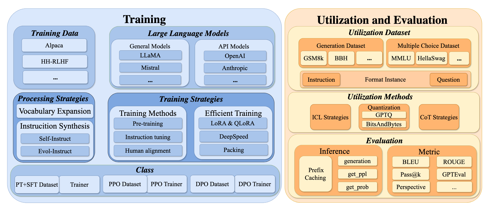

**LLMBox** | [Training](https://github.com/RUCAIBox/LLMBox/tree/main/training) | [Utilization](https://github.com/RUCAIBox/LLMBox/tree/main/utilization)

# LLMBox

LLMBox is a comprehensive library for implementing LLMs, including **a unified training pipeline** and **comprehensive model evaluation**. LLMBox is designed to be a one-stop solution for training and utilizing LLMs. Through a practical library design, we achieve a high-level of **flexibility** and **efficiency** in both training and utilization stages.




## Key Features

Training

- **Diverse training strategies:** We support multiple training strategies, including Supervised Fine-tuning (`SFT`), Pre-training (`PT`), `PPO` and `DPO`.
- **Comprehensive SFT datasets:** We support 9 SFT datasets as the inputs for training.
- **Tokenizer Vocabulary Merging:** We support the tokenizer merging function to expand the vocabulary.
- **Data Construction Strategies:** We currently support merging multiple datasets for training. `Self-Instruct` and `Evol-Instruct` are also available to process the dataset.
- **Parameter Efficient Fine-Tuning:** `LoRA` and `QLoRA` are supported in SFT or PT.
- **Efficient Training:** We support [`Flash Attention`](https://github.com/Dao-AILab/flash-attention) and `Deepspeed` for efficient training.

Utilization

- **Blazingly Fast:** By managing the KV Cache of prefixes, we can speed up local inference by up to 6x 🚀.
- **Comprehensive Evaluation:** 59+ commonly used [datasets](https://github.com/RUCAIBox/LLMBox/blob/main/docs/utilization/supported-datasets.md) and benchmarks in evaluating LLMs.
- **Evaluation Methods:** Accurately reproduce results from original papers of OpenAI, LLaMA, Mistral, and other models.
- **In-Context Learning:** We support various ICL strategies, including [`KATE`](https://aclanthology.org/2022.deelio-1.10/), [`GlobalE`](https://aclanthology.org/2022.acl-long.556/), and [`APE`](https://arxiv.org/abs/2211.01910).
- **Chain-of-Thought:** For some datasets, we support three types of CoT evaluation: `base`, [`least-to-most`](https://arxiv.org/abs/2205.10625), and [`pal`](https://arxiv.org/abs/2211.10435).
- **vLLM and Flash Attention Support:** We also support [`vLLM`](https://github.com/vllm-project/vllm) and [`Flash Attention`](https://github.com/Dao-AILab/flash-attention) for efficient inference.
- **Quantization:** BitsAndBytes and GPTQ quantization are supported.


## Documentations

See [documentations](https://github.com/RUCAIBox/LLMBox/tree/main/docs) for more details.

## Quick Start

### Install

```bash
git clone https://github.com/RUCAIBox/LLMBox.git && cd LLMBox
pip install -r requirements.txt
```

If you are only evaluating the OpenAI (or OpenAI compatible like DeepSeek, Perplexity) models, you can install the minimal requirements `requirements-openai.txt`.

For installation problem, see [trouble shooting](https://github.com/RUCAIBox/LLMBox/tree/main/docs/trouble_shooting/vllm_no_module_name_packaging.md).

<details>
<summary><b>Update LLMBox</b></summary>

Currently, you can simply pull the latest repository from GitHub to update LLMBox.

```bash
git pull
```

If you are facing a merge conflict, please try to drop, stash, or commit your local changes first.

```bash
git checkout local_changes && git add -p && git commit -m "local changes"
git checkout main
git pull
```

The above commands show how to commit your local changes to a new branch, and then update the LLMBox.

</details>

### Quick Start with Training

You can start with training a SFT model based on LLaMA-2 (7B) with deepspeed3:

```bash
cd training
bash download.sh
bash bash/run_ds3.sh
```

### Quick Start with Utilization

To utilize your model, or evaluate an existing model, you can run the following command:

```bash
python inference.py -m gpt-3.5-turbo -d copa  # --num_shot 0 --model_type chat
```

This is default to run the OpenAI GPT 3.5 turbo model on the CoPA dataset in a zero-shot manner.


## Training

LLMBox Training supports various training strategies and dataset construction strategies, along with some efficiency-improving modules. You can train your model with the following command:

```bash
python train.py \
    --model_name_or_path meta-llama/Llama-2-7b-hf \
    --data_path data/ \
    --dataset alpaca_data_1k.json \
    --output_dir $OUTPUT_DIR \
    --num_train_epochs 2 \
    --per_device_train_batch_size 8 \
    --gradient_accumulation_steps 2 \
    --save_strategy "epoch" \
    --save_steps 2 \
    --save_total_limit 2 \
    --learning_rate 1e-5 \
    --lr_scheduler_type "constant"
```

Alternatively, you can use the following preset bash scripts to train your model:

### Merging Tokenizer

If you want to pre-train your models on corpora with languages or tokens not well-supported in original language mdoels(e.g., LLaMA), we provide the tokenizer merging function to expand the vocabulary based on the corpora by using [sentencepiece](https://github.com/google/sentencepiece). You can check [merge_tokenizer.py](training/merge_tokenizer.py) for detailed information. Please follow the guide in [Pre-train](https://github.com/RUCAIBox/LLMBox/tree/main/training#2-continual-pre-training-with-your-own-corpora).

```bash
bash bash/run_7b_pt.sh
```

### Merging Datasets

If you want to train your models with a mix of multiple datasets, you can pass a list of dataset files or names to LLMBox. LLMBox will transfer each file or name into a PTDataset or SFTDataset, and merge them together to construct a combined dataset. You can also set the merging ratio of each dataset by passing a list of floats to LLMBox. Please follow the guide in [Merge Dataset](https://github.com/RUCAIBox/LLMBox/tree/main/training#3-merging-different-datasets-with-designated-ratios-for-training).

```bash
bash bash/run_7b_hybrid.sh
```

### Self-Instruct and Evol-Instruct

Since manually creating instruction data of high qualities to train the model is very time-consuming and labor-intensive, Self-Instruct and Evol-Instruct are proposed to create large amounts of instruction data with varying levels of complexity using LLM instead of humans. LLMBox support both Self-Instruct and Evol-Instruct to augment or enhance the input data files. Please follow the guide in [Self-Insturct and Evol-Instruct](https://github.com/RUCAIBox/LLMBox/tree/main/training#8-self-instruct-and-evol-instruct-for-generation-instructions)

```bash
python self_instruct/self_instruct.py --seed_tasks_path=seed_tasks.jsonl
```

For more details, view the [training](https://github.com/RUCAIBox/LLMBox/tree/main/training) documentation.

## Utilization

We provide a broad support on Huggingface models (e.g. `LLaMA-3`, `Mistral`, or the model you are building on), OpenAI, Anthropic, QWen and other OpenAI-compatible models for further utilization. Full list of model backends: [here](https://github.com/RUCAIBox/LLMBox/tree/main/utilization#supported-models).

Currently a total of 59+ commonly used datasets are supported, including: `HellaSwag`, `MMLU`, `GSM8K`, `GPQA`, `AGIEval`, `CEval`, and `CMMLU`. Full list of datasets: [here](https://github.com/RUCAIBox/LLMBox/blob/main/docs/utilization/supported-datasets.md).

```bash
CUDA_VISIBLE_DEVICES=0 python inference.py \
  -m llama-2-7b-hf \
  -d mmlu agieval:[English] \
  --model_type chat \
  --num_shot 5 \
  --ranking_type ppl_no_option
```

- 🔥 Recently supported datasets: `imbue_code`, `imbue_public`, and `imbue_private`.

- 🔥 See [benchmarking LLaMA3](https://github.com/RUCAIBox/LLMBox/blob/main/docs/utilization/benchmarking_llama3.md) for more examples.

<table>
    <tr>
        <td colspan=4 align="center"><b>Performance</b></td>
    </tr>
    <tr>
        <td rowspan=2><b>Model</b></td>
        <td><code>get_ppl</code></td>
        <td><code>get_prob</code></td>
        <td><code>generation</code></td>
    </tr>
    <tr>
        <td><b>Hellaswag (0-shot)</b></td>
        <td><b>MMLU (5-shot)</b></td>
        <td><b>GSM (8-shot)</b></td>
    </tr>
    <tr>
        <td><b>GPT-3.5 Turbo</b></td>
        <td>79.98</td>
        <td>69.25</td>
        <td>75.13</td>
    </tr>
    <tr>
        <td><b>LLaMA-2 (7B)</b></td>
        <td>76</td>
        <td>45.95</td>
        <td>14.63</td>
    </tr>
</table>

### Efficient Evaluation

We by default enable prefix caching for efficient evaluation. vLLM is also supported.

<table>
    <tr>
        <td colspan=6 align="center"><b>Time</b></td>
    </tr>
    <tr>
        <td rowspan=2><b>Model</b></td>
        <td rowspan=2><b>Efficient Method</b></td>
        <td><code>get_ppl</code></td>
        <td><code>get_prob</code></td>
        <td><code>generation</code></td>
    </tr>
    <tr>
        <td><b>Hellaswag (0-shot)</b></td>
        <td><b>MMLU (5-shot)</b></td>
        <td><b>GSM (8-shot)</b></td>
    </tr>
    <tr>
        <td rowspan=3><b>LLaMA-2 (7B)</b></td>
        <td><b>Vanilla</b></td>
        <td>0:05:32</td>
        <td>0:18:30</td>
        <td>2:10:27</td>
    </tr>
    <tr>
        <td><b>vLLM</b></td>
        <td>0:06:37</td>
        <td>0:14:55</td>
        <td>0:03:36</td>
    </tr>
    <tr>
        <td><b>Prefix Caching</b></td>
        <td>0:05:48</td>
        <td>0:05:51</td>
        <td>0:17:13</td>
    </tr>
</table>

You can also use the following command to use vllm:


```bash
python inference.py -m ../Llama-2-7b-hf -d mmlu:abstract_algebra,anatomy --vllm True  # --prefix_caching False --flash_attention False
```

To evaluate with quantization, you can use the following command:

```python
python inference.py -m model -d dataset --load_in_4bits  # --load_in_8_bits or --gptq
```

### Evaluation Method

Various types of evaluation methods are supported:

<table>
    <tr>
        <td><b>Dataset</b></td>
        <td><b>Evaluation Method</b></td>
        <td><b>Instruction</b></td>
    </tr>
    <tr>
        <td><p><b>Generation</b></p>
        <p><pre><code>{
  "question":
    "when was ...",
  "answer": [
    '14 December 1972',
    'December 1972'
  ]
}</code></pre></p></td>
        <td><p><code>generation</code></p><p>Generate based on the source text</p></td>
        <td><p><pre><code>Q: When was ...?
A: ________</code></pre></p></td>
    </tr>
    <tr>
        <td rowspan=3><p><b>MultipleChoice</b></p>
<pre><code>{
  "question":
    "What is the ...?",
  "choices": [
    "The first",
    "The second",
    ...
  ],
  "answer": 3
}</code></pre></td>
        <td rowspan=2><p><code>get_ppl</code></p><p>Calculate perplexity of the option text based on the source text</p></td>
        <td><p style="text-align: center;"><code>ppl_no_option</code></p>
<p><pre><code>Q: What is ...?
A: The first
   └--ppl--┘</code></pre></p></td>
    </tr>
    <tr>
        <td><p style="text-align: center;"><code>ppl</code></p>
<p><pre><code style="border-style: solid;">Q: What is ...?
A. The first
B. The second
C. ...
A: A. The first
   └----ppl---┘</code></pre></p></td>
    </tr>
    <tr>
        <td><p><code>get_prob</code></p><p>Get the probability of each option label</p></td>
        <td><p style="text-align: center;"><code>prob</code></p>
<p><pre><code>Q: What is ...?
A. The first
B. The second
C. ...
A: _
   └→ [A B C D]</code></pre></p></td>
    </tr>
</table>

You can use --instruction to pass a jinja template to override the default instruction.

By default, we use the `get_ppl` method with `ppl_no_option` ranking type for `MultipleChoiceDataset` and the `generation` method for `GenerationDataset`. You can also use the following command to use the `get_prob` method or `ppl` variant of `get_ppl` for MultipleChoiceDataset:

```python
python inference.py -m model -d dataset --ranking_type prob  # or ppl
```

We also support In-Context Learning and Chain-of-Thought evaluation for some datasets:

```python
python inference.py -m model -d dataset --kate  # --globale or --ape
python inference.py -m model -d dataset --cot least_to_most  # --base or --pal
```

For a more detailed instruction on model utilization, view the [utilization](https://github.com/RUCAIBox/LLMBox/tree/main/utilization) documentation.

For a full list of evaluation results, see our paper [LLMBox: A Comprehensive Library for Large Language Models](https://aclanthology.org/2024.acl-demos.37.pdf).

## Contributing

Please let us know if you encounter a bug or have any suggestions by [filing an issue](https://github.com/RUCAIBox/LLMBox/issues).

We welcome all contributions from bug fixes to new features and extensions.

We expect all contributions discussed in the issue tracker and going through PRs.

For more details, view the [CONTRIBUTING](https://github.com/RUCAIBox/LLMBox/tree/main/docs/CONTRIBUTING.md) documentation.

---

We thank the following contributors for their contributions to LLMBox:

- [@xansar](https://github.com/xansar) for fixing multiple complex issues like batch sampler and self-consistency.


## The Team

LLMBox is developed and maintained by [AI Box](http://aibox.ruc.edu.cn/). See more details in [change log](https://github.com/RUCAIBox/LLMBox/tree/main/utilization#change-log)

## License

LLMBox uses [MIT License](./LICENSE).

## Reference

If you find LLMBox useful for your research or development, please cite the following papers:

```
@inproceedings{tang2024llmbox,
  title={LLMBox: A Comprehensive Library for Large Language Models},
  author={Tang, Tianyi and Yiwen, Hu and Li, Bingqian and Luo, Wenyang and Qin, ZiJing and Sun, Haoxiang and Wang, Jiapeng and Xu, Shiyi and Cheng, Xiaoxue and Guo, Geyang and others},
  booktitle={Proceedings of the 62nd Annual Meeting of the Association for Computational Linguistics (Volume 3: System Demonstrations)},
  pages={388--399},
  year={2024}
}
```
