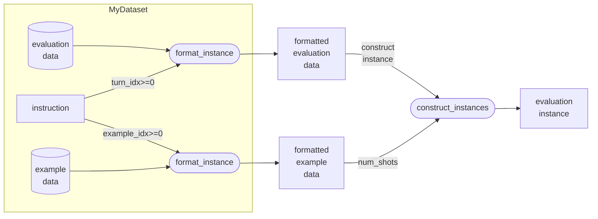

# Customize Dataset

If you find some datasets are not supported in the current version, feel free to implement your own dataset and submit a PR.

See a full list of supported datasets at [here](https://github.com/RUCAIBox/LLMBox/tree/main/docs/utilization/supported-datasets.md).

## Choose the Right Dataset

We provide two types of datasets: [`GenerationDataset`](https://github.com/RUCAIBox/LLMBox/tree/main/utilization/dataset/generation_dataset.py) and [`MultipleChoiceDataset`](https://github.com/RUCAIBox/LLMBox/tree/main/utilization/dataset/multiple_choice_dataset.py).

### Multiple-Choice Dataset

`MultipleChoiceDataset` is for multiple-choice questions. It extracts the answer from the model output (`get_ppl`, `get_prob`, `generation`) and uses `Accuracy` metrics by default.

| Metrics | Evaluation Method | Model Output | Description |
| --- | --- | --- | --- |
| `Accuracy` | `get_ppl` | `[(perplexity, target length), ...]` | The answer is the option with the lowest `perplexity / target_length` scores. |
| `Accuracy:Norm` | `get_ppl` | `[(perplexity of target, _), (perplexity of normalized text, _), ...]` | The answer is the option with the lowest `perplexity_of_target - perplexity_of_normalized_text` scores. |
| `Accuracy` | `get_prob` | `[(probability, target length), ...]` | The answer is the option with the highest `probability / target_length` scores. |
| `Accuracy` | `generation` | `[generated text, ...]` | Extracts answer labels (`"A", "B", ...`) with regex. |

### Generation Dataset

`GenerationDataset` is for generation tasks.

You can define the generation arguments (like `temperature`, `stop`, ...) to let model generate the answer and define your own metrics (like `BLEU`, `EM`, `F1`, `GPTEval`, `Pass@K`, ...).

## Implement a New Dataset

These are the attributes you can define in a new dataset:

- `instruction` (`str`, **required**): Dataset-specific instruction for the task.

- `metrics` (`List["Metric"]`, **required**): The metric functions used for evaluation.

- `evaluation_set` (`str`, **required\***): The evaluation split of dataset. Evaluation data will be automatically loaded. This is required unless `load_raw_dataset` is overwritten.

- `example_set` (`Optional[str]`): The example split of dataset. Example data will be automatically loaded if this is not None.

- `load_args` (`Union[Tuple[str], Tuple[str, str], Tuple[()]]`, **required\***): Arguments for loading the dataset with huggingface `load_dataset`. See [load from source data](https://github.com/RUCAIBox/LLMBox/tree/main/docs/utilization/how-to-customize-dataset.md#load-from-source-data) for details.

- `extra_model_args` (`Dict[str, Any]`): Extra arguments for the model like `temperature`, `stop` etc. See `set_generation_args`, `set_prob_args`, and `set_ppl_args` for details.

Then implement the following methods or properties:

- `format_instance` (**required**): Format the instance for the model input with `instruction` template.
- `references` (**required**): Return the reference answers for evaluation.
- `init_arguments`: Initialize the arguments for the dataset. This is called before the raw dataset is loaded.

See [here](https://github.com/RUCAIBox/LLMBox/tree/main/docs/utilization/how-to-customize-dataset.md#advanced-topics) for advanced topics.


## Load from Source Data

You can load the raw dataset by one of the following methods:

### Load from Hugging Face Datasets

You can load the dataset from the Hugging Face [`datasets`](https://huggingface.co/datasets) library by setting the `load_args` attribute.

Supported formats:

 - `(dataset_name,)`:
   - If the dataset only has one subset. E.g., `('race',)`.
   - Or the dataset has more than one subset name. E.g., `("allenai/ai2_arc",)` accepts command line argument `-d arc:ARC-Easy,ARC-Challenge`, which will load `("allenai/ai2_arc", "ARC-Easy")` and `("allenai/ai2_arc", "ARC-Challenge")` subsets.
 - `(dataset_name, subset_name)`: If the dataset is a subset of a dataset collection. E.g., `('super_glue', 'copa')`.
 - `()`: Sepcial case like `wmt` dataset. The `dataset_name` is defined else where.

### Load with Custom Function

Or overwrite `load_raw_dataset` function: Set the `self.evaluation_data` and `self.example_data`.

```python
from .utils import load_raw_dataset_from_file, get_raw_dataset_loader

class MyDataset(Dataset):
    def load_raw_dataset(self, dataset_path, subset_name, evaluation_set, example_set):
        self.evaluation_data = get_raw_dataset_loader(...)("test")
        self.example_data = load_raw_dataset_from_file("examples.json")
```

## Formatting the instances

Then, format the instance by implementing the `instruction` attribute and `format_instance` method. The returned instance should be a dictionary with keys accessible in the instruction string. Both `jinja2` and `f-string` are supported for the instruction string.



The following table shows the keys that should be returned from the `format_instance` method and the keys that can be accessed in the instruction string:

<table class="waffle" cellspacing="0" cellpadding="0">
    <thead>
        <tr>
        <th class="column-headers-background"><code>format_instance</code></th>
        <th class="column-headers-background">Type</th>
        <th class="column-headers-background"><code>instruction</code></th>
        <th class="column-headers-background">Type</th>
        <th class="column-headers-background">Description</th>
        </tr>
    </thead>
    <tbody>
        <tr>
        <td class="s1" dir="ltr">customized</td>
        <td class="s1" dir="ltr"><code>Any</code></td>
        <td class="s1" dir="ltr">customized</td>
        <td class="s1" dir="ltr"><code>Any</code></td>
        <td class="s2 softmerge" dir="ltr">
            <div class="softmerge-inner">Customized arguments that accessible in the instruction string</div>
        </td>
        </tr>
        <tr>
        <td class="s1" dir="ltr">source</td>
        <td class="s1" dir="ltr"><code>str</code> or <code>list</code></td>
        <td class="s1" dir="ltr" rowspan="2">source</td>
        <td class="s1" dir="ltr" rowspan="2"><code>str</code></td>
        <td class="s1" dir="ltr">Source text</td>
        </tr>
        <tr>
        <td class="s1" dir="ltr">source_idx</td>
        <td class="s1" dir="ltr"><code>int</code></td>
        <td class="s1" dir="ltr">Index of correct context (winogrande)</td>
        </tr>
        <tr>
        <td class="s1" dir="ltr">options</td>
        <td class="s1" dir="ltr"><code>list</code></td>
        <td class="s1" dir="ltr">options</td>
        <td class="s1" dir="ltr"><code>str</code></td>
        <td class="s1" dir="ltr">Options of MCQ</td>
        </tr>
        <tr>
        <td class="s1" dir="ltr">target</td>
        <td class="s1" dir="ltr"><code>str</code></td>
        <td class="s1" dir="ltr" rowspan="3">target</td>
        <td class="s1" dir="ltr" rowspan="3"><code>str</code></td>
        <td class="s1" dir="ltr" rowspan="3">Target text. Either return <code>target</code> or <code>target_idx</code> in <code>format_instance</code>. <code>target_idx</code> is a alias of <code>target_idx</code></td>
        </tr>
        <tr>
        <td class="s1" dir="ltr">target_idx</td>
        <td class="s1" dir="ltr"><code>int</code></td>
        </tr>
        <tr>
        <td class="s1" dir="ltr">label</td>
        <td class="s1" dir="ltr"><code>int</code></td>
        </tr>
        <tr>
        <td class="s1" dir="ltr" colspan="2" rowspan="7"><i>No need to return from format_instance</i></td>
        <td class="s1" dir="ltr">num_turns</td>
        <td class="s1" dir="ltr"><code>int</code></td>
        <td class="s1" dir="ltr">Total turns of multi-turn conversation (default: 0)</td>
        </tr>
        <tr>
        <td class="s1" dir="ltr">turn_idx</td>
        <td class="s1" dir="ltr"><code>int</code></td>
        <td class="s1" dir="ltr">evaluation_data: 0..num_turns-1 (inclusive)<br>example_data: -1</td>
        </tr>
        <tr>
        <td class="s1" dir="ltr">real_num_shots</td>
        <td class="s1" dir="ltr"><code>int</code></td>
        <td class="s2 softmerge" dir="ltr">
            <div class="softmerge-inner">The num shots formatted as examples</div>
        </td>
        </tr>
        <tr>
        <td class="s1" dir="ltr">example_idx</td>
        <td class="s1" dir="ltr"><code>int</code></td>
        <td class="s2 softmerge" dir="ltr">
            <div class="softmerge-inner">evaluation_data: -1<br>example_data: 0..real_num_shots-1 (inclusive)</div>
        </td>
        </tr>
        <tr>
        <td class="s1" dir="ltr">dataset_name</td>
        <td class="s1" dir="ltr"><code>str</code></td>
        <td class="s1" dir="ltr">Dataset name</td>
        </tr>
        <tr>
        <td class="s1" dir="ltr">subset_name</td>
        <td class="s1" dir="ltr"><code>str</code></td>
        <td class="s2 softmerge" dir="ltr">
            <div class="softmerge-inner">Subset name of current dataset</div>
        </td>
        </tr>
        <tr>
        <td class="s1" dir="ltr">display_name</td>
        <td class="s1" dir="ltr"><code>str</code></td>
        <td class="s2 softmerge" dir="ltr">
            <div class="softmerge-inner">Display name of current dataset</div>
        </td>
        </tr>
    </tbody>
</table>

### Jinja2 Template

Jinja is a fast, expressive, extensible templating engine. Special placeholders in the template allow writing code similar to Python syntax. `jinja2` is supported for the instruction string.

You can use the `{{ variable }}` syntax to insert variables into the instruction string.

If a variable is optional, you can use the `if` statement to check if the variable exists, to avoid getting `"None"` in the instruction string:

```python
""
"{{ passage }}"
""
```

Notes its differnece from the following syntax, which includes two newlines if `passage` is not `None`:

```python
"""
{{ passage }}
"""
```

Alternatively, you can use the inline `if` statement:

```python
"{{ passage if passage }}"
```

As much as possible, we’ve stripped the whitespaces from the variables to avoid extra spaces in the output. For example, `{{ passage }}` will not print extra spaces around the `passage` variable. You can use `{{ passage + '\n' if passage }}` to add a newline after the passage.

However, be aware that Jinja is a general-purpose templating engine, and it may treat whitespace between blocks on the same line as significant and print it to the output. We strongly recommend checking that your template isn’t printing extra spaces where it shouldn’t be before you upload it!

See more details about Jinja2 syntax [here](https://jinja.palletsprojects.com/en/3.1.x/templates).

If you want to check the formatted result, you can add a test in the [`tests/utilization/dataset/test_formatting`](https://github.com/RUCAIBox/LLMBox/tree/main/tests/utilization/dataset/test_formatting.py).

### Foramting Multiple-Choice Dataset:

```python
class MyDataset(MultipleChoiceDataset):
    instruction = "Answer the following question.\n\n{{question}}{{'\n' + options if options}}\nAnswer:"

    def format_instance(self, instance):
        return dict(
            question=instance["question"],
            target_idx=instance["answer"],
            options=[instance[label] for label in ["A", "B", "C", "D"]],
        )
```

In `get_ppl` (`ppl_no_option`) evaluation method, this will generate four evaluation instances:

```python
[
    {"source": "Answer the following question.\n\n[Question A]\nAnswer:", "target": "[Answer A]"},
    {"source": "Answer the following question.\n\n[Question A]\nAnswer:", "target": "[Answer B]"},
    {"source": "Answer the following question.\n\n[Question A]\nAnswer:", "target": "[Answer C]"},
    {"source": "Answer the following question.\n\n[Question A]\nAnswer:", "target": "[Answer D]"},
]
```

And in `get_prob` method, this will generate one evaluation instance:

```python
[
    {"source": "Answer the following question.\n\n[Question A]\nA. [Answer A]\nB. [Answer B]\nC. [Answer C]\nD. [Answer D]\nAnswer:", "target": "A"},
]
```

### Formatting Multiple-Context Dataset:

For datasets with multiple contexts (like `winogrande`), you can format the instance as follows:

```python
class MyDataset(MultipleChoiceDataset):
    instruction = "Answer the following question.\n\n{source}\nAnswer:"
    ...

    def format_instance(self, instance):
        return dict(
            source=[instance["ctx_a"], instance["ctx_b"]],
            source_idx=int(instance["answer"]) - 1,
            target=instance["completion"],
        )
```

which generates two evaluation instances:

```python
[
    {"source": "Answer the following question.\n\n[Context A]\nAnswer:", "target": "[Completion]"},
    {"source": "Answer the following question.\n\n[Context B]\nAnswer:", "target": "[Completion]"},
]
```

### Formatting Generation Dataset:

```python
INSTRUCTION = """Answer the following question.

{question}
Answer:"""
NO_INSTRUCTION = "{question}"

class MyDataset(GenerationDataset):

    instruction = None
    metrics = [Em(), F1()]
    ...

    def init_arguments(self):
        if self.model_type == "base":
            self.instruction = NO_INSTRUCTION
        else:
            self.instruction = INSTRUCTION

    def format_instance(self, instance):
        return dict(
            question=instance["question"],
            target=instance["answer"],
        )
```

To evaluate a pre-trained model that lacks instruction-following capabilities, you can provide an instruction explicitly by assigning a completion instruction `NO_INSTRUCTION = "{question}"` to the model, or pass an argument `--instruction "{question}"` in the command line.

### Formatting Multi-Turn Dataset:

For multi-turn datasets (like `mt_bench`), you can format the instance as follows:

```python
class MyDataset(GenerationDataset):

    instruction = "{{source[turn_idx]}}"
    metrics = [GPTEval(multi_turn=False)]
    multi_turn = True
    ...

    def format_instance(self, instance):
        return dict(
            source=[instance["question_1"], instance["question_2"]]
        )

    def post_processing(self, predictions: List[Tuple[str, ...]]):
        # By default, model outputs a tuple of predictions for each turn
        # You can implement the post_processing method to return the last turn's assistant output
        return [pred[-1] for pred in predictions]
```

## Formatting the references

You can implement the `references` method to return the reference answers for evaluation.

```python
from functools import cached_property

class MyDataset(MultipleChoiceDataset):

    ...

    @cached_property
    def references(self):
        return [i["answer"] for i in self.evaluation_data]

```

## Advanced Topics

For advanced topics, you can define the following attributes:

- `category_column` (`Optional[str]`): The column name of the categories, e.g., winogender. Used to calculate the metric for each category.

- `categorized_subsets` (`Optional[Dict[str, List[str]]]`): The subsets of each category. For example, mmlu contains four categories `stem`, `humanities`, `social_sciences`, and `other` (default: None).

- `banned_subsets` (`Optional[List[str]]`): The banned subsets for the dataset (default: None).

- `use_normalization` (`bool`): Use normalization (default: False). See ARC, OpenBookQA, and RACE for details.

- `supported_cot` (`List[str]`): Define the supported `cot` for the dataset.

- `multi_turn` (`bool`): Define whether the dataset is multi-turn (default: False)

You can also overwrite the following methods:

- `load_raw_dataset`: Load the raw dataset from the source data.

- `post_processing`: Post-processing the model output before evaluation.

- `construct_examples`: Construct the few-shot examples for the dataset in your own way. In most cases, you can use the default implementation by specifying `--num_shots 5`.

Example:

```python
def NewDataset(GenerationDataset):

    instruction = "Answer the following question.\n\n{source}"
    metrics = [Accuracy()]
    evaluation_set = "test"
    example_set = "dev"
    load_args = ("huggingface/path", "subset")

    extra_model_args = dict(temperature=0)
    category_subsets = {"Group": ["subset1", "subset2"]}

    def format_instance(self, instance):
        src, tgt = func(instance, self.example_data)
        return dict(source=src, target=tgt)

    def reference(self):
        return [i["answer"] for i in self.eval_data]
```

See [`Dataset`](https://github.com/RUCAIBox/LLMBox/tree/main/utilization/dataset/dataset.py) for more details.

## Contributing

If you have implemented a new dataset, and are preparing to submit a PR, please also add your dataset name in the pytest [test case](https://github.com/RUCAIBox/LLMBox/tree/main/tests/dry_test/test_datasets.py).
