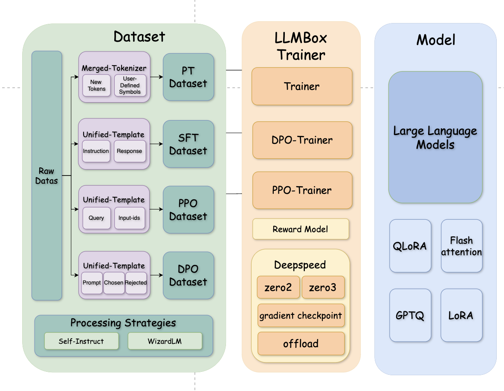

<!-- ## Supervised Fine-tuning and Continual Pre-training -->
# LLMBox-Training

LLMBox-Training is developed based on Python and PyTorch for developing a unified and efficient framework for training language models. The library is built on top of the [`transformers`](https://github.com/huggingface/transformers) library by  🤗 Hugging Face. 


## Feature

+ **Diverse training strategies.** LLMBox incorporates multiple training strategies of Large Language Models, including Supervised Fine-tuning(SFT), Pre-training, PPO(Proximal Policy Optimization), DPO(Direct Preference Optimization) and GPTQ(Generative Pre-trained Transformer for Querying Tables). 

+ **Comprehensive datasets and data construction strategies .** We enable users to use various existing datasets (e.g. alpaca) as the inputs for training. Self-instruct and Evol-instruct are also available to process the dataset. Users can also merge multiple datasets together according to a defined ratio for Supervised Fine-tuning or Pre-training.

+ **Parameter efficient fine-tuning.** We support LoRA and QLoRA in LLMBox for parameter efficient fine-tuning. Simply setting lora or qlora in arguments enables the parameter efficient fine-tuning through the process of SFT or PT.

+ **High efficiency in the training of Large Language Models** We deploy Flash attention and Deepspeed to provide model training with high efficiency and unprecedented cost reduction at all scales


## Overview


The Training section of LLMBox consists of three main parts, including Dataset, Model and Trainer. 
In Datset section, LLMBox generates datasets in unified-templates for each training strategies, while provide extra modules for users‘ demands, involving tokenizer merging, dataset merging and data processing strategies(Self-instruct and Evol-instruct). 
In Model section, LLMBox covers various efficient training strategies for large language models. Users can set parameters in bash files to enable or disable the functions, involving LoRA, QLoRA, GPTQ and Flash_attention.
In Trainer section, LLMBox offers three pipelines for model training, including Trainer(for SFT and PT), PPO-Trainer(for PPO) and DPO-Trainer(for DPO). All of training pipelines can be sped up by deepspeed, and we provide corresponding config files for deepspeed in `configs`. 

## Dataset
#### Supervised Fine-tuning Dataset(SFTDataset)

Currently, LLMBox support formats of the following instruction-tuning datasets:

| Dataset       | Examples | Download                                                     |
| ------------- | -------- | ------------------------------------------------------------ |
| Alpaca        | 52K      | [link](https://github.com/tatsu-lab/stanford_alpaca/raw/main/alpaca_data.json ) |
| Dolly         | 15K      | [link](https://huggingface.co/datasets/databricks/databricks-dolly-15k/resolve/main/databricks-dolly-15k.jsonl) |
| OpenAssistant | 161K     | [link]( https://huggingface.co/datasets/OpenAssistant/oasst1/resolve/main/2023-04-12_oasst_ready.trees.jsonl.gz) |
| ShareGPT      | 90K      | [link]( https://huggingface.co/datasets/anon8231489123/ShareGPT_Vicuna_unfiltered/resolve/main/HTML_cleaned_raw_dataset/sg_90k_part1_html_cleaned.json)    [link](https://huggingface.co/datasets/anon8231489123/ShareGPT_Vicuna_unfiltered/resolve/main/HTML_cleaned_raw_dataset/sg_90k_part2_html_cleaned.json) |
| LIMA          | 1K       | [link]( https://huggingface.co/datasets/GAIR/lima/raw/main/train.jsonl) |
| Evol-Instruct | 52K      | [link]( https://huggingface.co/datasets/WizardLM/WizardLM_evol_instruct_V2_196k/resolve/main/WizardLM_evol_instruct_V2_143k.json) |
| Belle         | 1500K    | [link]( https://huggingface.co/datasets/BelleGroup/train_0.5M_CN/resolve/main/Belle_open_source_0.5M.json) |
| Self_Instruct | 82K      | [link](https://raw.githubusercontent.com/yizhongw/self-instruct/main/data/gpt3_generations/batch_221203/all_instances_82K.jsonl) |
| Flan          | 4400K    | [link](https://github.com/RUCAIBox/LLMBox/blob/main/sft/utils/download_flanv2.py)                                                             |

You can also download these datasets by running the following scripts:

```shell
bash download.sh
```

You can train your model by following the guide in [Supervised Fine-tuning](#1-supervised-fine-tuning-instruction-tuning) or [Merge Dataset](#3-merging-different-datasets-with-designated-ratios-for-training)

#### Pre-training Dataset(PTDataset)

Pre-training Dataset in LLMBox requires a text file as the input data. You can construct your own text files and follow the guide in [Pre-train](#2-continual-pre-training-with-your-own-corpora) or [Merge Dataset](#3-merging-different-datasets-with-designated-ratios-for-training)

#### PPO Dataset

The default dataset used in LLMBox PPO trainer is `imdb`.

| Dataset | Examples | Source                                       |
| ------- | -------- | -------------------------------------------- |
| Imdb    | 100K     | [link](https://huggingface.co/datasets/imdb) |

You can download the dataset from huggingface or you can directly set the `dataset_name` to `imdb`.

You can also modify the PPO Dataset code to fit your own datasets. Please follow the guide in [PPO training](#4-training-with-ppoproximal-policy-optimization).


#### DPO Dataset

The default dataset used in LLMBox DPO trainer is `Dahoas/synthetic-instruct-gptj-pairwise`.

| Dataset | Examples | Source                                       |
| ------- | -------- | -------------------------------------------- |
| Dahoas/synthetic-instruct-gptj-pairwise   | 33143     | [link](https://huggingface.co/datasets/Dahoas/synthetic-instruct-gptj-pairwise) |

You can download the dataset from huggingface or you can directly set the `dataset_name` to `Dahoas/synthetic-instruct-gptj-pairwise`.

You can also modify the DPO Dataset code to fit your own datasets. Please follow the guide in [DPO training](#5-training-with-dpodirect-preference-optimization).

## Dataset Construction Strategies
+ **Merging Tokenizer**
If you want to pre-train your models on corporas with languages or tokens not well-supported in original language mdoels(e.g., LLaMA), we provide the tokenizer merging function to expand the vocabulary based on the corpora you provided by using [sentencepiece](https://github.com/google/sentencepiece). Please check [merge_tokenizer.py](https://github.com/RUCAIBox/LLMBox/blob/main/sft/merge_tokenizer.py) for detailed information. Please follow the guide in [Pre-train](#2-continual-pre-training-with-your-own-corpora).

+ **Merging Datasets**
If you want to train your models with a mix of multiple datasets, you can pass a list of dataset files or names to LLMBox. LLMBox will transfer each file or name into a PTDataset or SFTDataset, and merge them together to construct a combined dataset. You can also set the merging ratio of each dataset by passing a list of float to LLMBox. Please follow the guide in [Merge Dataset](#3-merging-different-datasets-with-designated-ratios-for-training).

+ **Self-Instruct and Evol-Instruct**
Since manually creating instruction data of high qualities to train the model is very time-consuming and labor-intensive, Self-Instruct and Evol-Instruct are proposed to create large amounts of instruction data with varying levels of complexity using LLM instead of humans. LLMBox support both Self-Instruct and Evol-Instruct to augment or enhance the input data files. Please follow the guide in [Self-Insturct and Evol-Instruct](#8-self-instruct-and-evol-instruct-for-generation-instructions)


## Guide
With the source code, you can use multiple functions with following steps.

### 1. Supervised fine-tuning (instruction tuning)
#### Downloading the SFT dataset
```shell
bash download.sh
```

#### Training a SFT model
Just change the `data_path` in `bash/run_7b_ds3.sh` to the path you want, e.g., `data/alpaca_data.json`. Then run the following script:
```shell
bash bash/run_7b_ds3.sh
```

The default behaviour is to train the LLaMA-2-7b model on the subset of the alpaca dataset.

### 2. Continual pre-training with your own corpora

#### Merging tokenizer

If you want to add new tokens (such as Chinese characters) to your vocabulary and then continual pre-train the model on your corpora, you just need to prepare the corpora under the folder `data/chinese.txt` and run the following script:

```shell
bash bash/run_7b_pt.sh
```

It will first merge the vocabulary of your corpora and the original vocabulary and then tune the parameters of the whole model to adapt to your corpora.

#### User-defined symbols

If you want to add user-defined symbols when merging new tokenizers, you can rewrite the `user_defined_symbols.json`. 

```json
{
    "list": [
    	"symbol1",
    	"symbol2"
    ]
}
```

#### Others
You can also leverage part of the script in `bash/run_7b_pt.sh` to just merge the tokenizer or continual pre-train the model using your corpora with the original tokenizer.

### 3. Merging different datasets with designated ratios for training
LLMBox supports merging different datas together to train the model. Just change the `data_set` in `bash/run_7b_hybrid.sh` to a list of file names in `data_path` separated by white space. LLMBox will automatically concates the dataset together if you do not set `dataset_ratio` and `max_steps`.

If you want to merge different datas with designated ratios, you can change `dataset_ratio` to a list of floats separated by white space, and `max_steps` is required when setting `dataset_ratio`. LLMBox will merge the dataset with the ratio you set. After changing the parameters, you can run the following script:

```shell
bash bash/run_7b_hybrid.sh
```
The default behaviour is to train the LLaMA-2-7b model on the merged dataset.

### 4. Training with PPO(Proximal Policy Optimization)
If you want to use your individual data to train language models with PPO(Proximal Policy Optimization), you can change the `data_path` in `bash/run_ppo.sh` to the path you want, e.g., `data/ppo.json`. Then run the following script:
```shell
bash bash/run_ppo.sh
```
Since PPO training strategy requires a reward model, you can change the `reward_model_name` in `bash/run_ppo.sh` to the model path you want or the model in huggingface, e.g., `OpenAssistant/reward-model-deberta-v3-large-v2`. The default behaviour is to train the LLaMA-2-7b model on the dataset.

### 5. Training with DPO(Direct Preference Optimization)
If you want to use your data to train language models with DPO(Direct Preference Optimization), you can change the `data_path` in `bash/run_dpo.sh` to the path you want, e.g., `data/dpo.json`, or the dataset name in huggingface, e.g., `Dahoas/synthetic-instruct-gptj-pairwise`, which contains chosen and rejected texts for each query. Then run the following script:
```shell
bash bash/run_dpo.sh
```

The default behaviour is to train the LLaMA-2-7b model on the dataset.

### 6. Training with GPTQ(Generative Pre-trained Transformer for Querying Tables)
LLMBox supports training models with GPTQ. You can run the following script:
```shell
bash bash/run_gptq.sh
```
You can change the following parameters in `bash/run_gptq.sh` to adjust the training process, including `bits`,`group_size`,`damp_percent`,`use_triton`, and `unquantized_model_dtype`.
The default behaviour is to train the LLaMA-2-7b model with GPTQ.

### 7. Parameter Efficient Fine-tuning(LoRA and QLoRA)
LLMBox supports PEFT(Parameter Efficient Fine-tuning) strategies, including LoRA and QLoRA. Just add the following scripts in your bash files to enable LoRA or QLoRA.
```shell
--lora True
```
```shell
--qlora True
```
You can also simply run the following script:
```shell
bash bash/run_7b_lora.sh
```
```shell
bash bash/run_7b_qlora.sh
```
The default behaviour is to train the LLaMA-2-7b model on the subset of the alpaca dataset with LoRA or QLoRA.

### 8. Self-Instruct and Evol-Instruct for generation instructions
LLMBox supports Self-Instruct and Evol-Instruct to generate instructions. 
For Self-Instruct, we provide json files with seed tasks in English and Chinese. You can set `seed_tasks_path` to one of them or your own instruction data and run the following script:
```shell
python self_instruct/self_instruct.py --seed_tasks_path=seed_tasks.jsonl
```
For Evol-Instruct, we provide the program for generating instructions on `alpaca_data_cleaned.json`. You can first download this data from the [link](https://github.com/gururise/AlpacaDataCleaned/blob/main/alpaca_data_cleaned.json) and then run the following script:
```shell
python evol_instruct.py --seed_tasks_path=alpaca_data_cleaned.json
```


